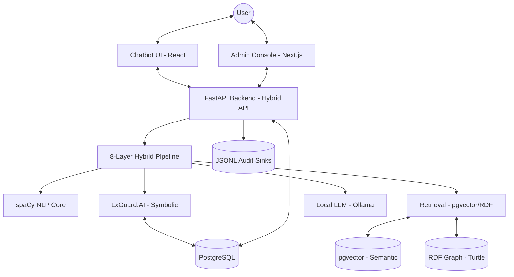
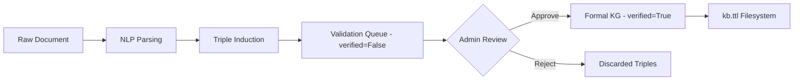
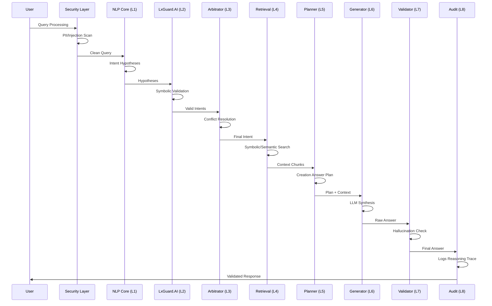

# LxGuard.AI: Comprehensive Technical Documentation

## 1. Full System Overview

### Purpose
The **LxGuard.AI** is a Hybrid Neuro-Symbolic Conversational Architecture designed for enterprise knowledge retrieval in regulated environments. It combines the flexibility of Large Language Models (LLMs) with the deterministic control of Symbolic Reasoning (Expert Systems) and Formal Ontologies. This hybrid approach ensures that answers are grounded in verified facts, compliant with enterprise rules, and resistant to hallucinations.

### High-Level Architecture
The system is structured into **8 distinct layers**, following a "Neuro-Symbolic" orchestration pattern:

1.  **Security Layer**: PII detection, redaction, and prompt injection filtering.
2.  **NLP Core Layer**: Probabilistic semantic parsing and intent hypothesis generation (spaCy).
3.  **LxGuard.AI Layer**: Deterministic validation of intents using formal ontology and production rules.
4.  **Intent Arbitration Layer**: Bridge between probabilistic NLP and symbolic expert rules to resolve conflicts.
5.  **Retrieval Layer**: Multi-tier engine (Symbolic, Semantic (pgvector), Evidence, Graph (RDF)).
6.  **Answer Planning Layer**: Creates a structured "blueprint" for the LLM to follow.
7.  **Generation Layer**: Controlled synthesis of the answer using a local LLM (Ollama).
8.  **Validation Layer**: Self-critique of the generated answer against the plan and evidence.
9.  **Audit Layer**: Immutable logging to JSONL and PostgreSQL for compliance.

25.  **Control**: The LxGuard.AI (Symbolic) acts as a supervisor, pruning LLM outputs and enforcing rigid constraints.
26.  **Output**: A validated, cited, and audited response is returned to the user.

#### System Architecture Diagram

---

## 2. The Three Answer Modes (Tiers of Reasoning)

The system operates in three distinct reasoning modes, selectable via the `mode` parameter in the Chat API.

### Mode A: Hybrid (Expert + RAG) - Default
*   **Logic**: The primary 8-layer `HybridPipeline`.
*   **Workflow**: NLP -> Expert Validation -> RAG Retrieval -> LLM Generation -> Self-Critique.
*   **Best For**: Complex enterprise queries requiring grounded facts and rule compliance.

### Mode B: General (LLM Only)
*   **Logic**: Uses the `LLMEngine` wrapper.
*   **Workflow**: Direct query to local Ollama model with a general system prompt.
*   **Best For**: General questions, greeting, or tasks outside the local domain (e.g., "Write a poem").

### Mode C: External (LOD / SPARQL)
*   **Logic**: Uses `LODClient` and `HybridKnowledgeAgent`.
*   **Workflow**: Entity extraction -> SPARQL Query (DBpedia) -> Abstract Synthesis.
*   **Best For**: Factual enrichment from the Linked Open Data cloud when local knowledge is missing.

---

## 3. Admin Dashboard & Human-in-the-Loop (HITL)

The Admin Dashboard provides the "Symbolic Control Surface" for the system.

### Knowledge Graph & Triple Management (HITL)

*   **The Problem**: Automatic SVO (Subject-Verb-Object) extraction from documents can be noisy.
*   **The Solution**: Induced triples are placed in a **Validation Queue**.
*   **HITL Workflow**:
    1.  `OntologyInductionEngine` extracts triples.
    2.  Triples are saved with `verified=False`.
    3.  Admin reviews triples in the graph visualizer.
    4.  Admin clicks **Approve** (adds to formal KG) or **Reject** (prunes from queue).
    5.  `ExpertAgent.manage_triple` executes the final update to `kb.ttl`.

### Rule & Intent Management
*   **Intents**: Define the "What" (e.g., `Deployment`, `HR_Policy`). Admin can set risk levels and confidence thresholds.
*   **Rules**: Define the "Why" and "Who". Symbolic rules map intents to RBAC roles and specific actions (Allow/Deny/Audit).
*   **Dynamic Loading**: Rules are stored in PostgreSQL and reloaded into the `ExpertAgent` at runtime via `RuleLoader`.

### Document Operations
*   **Knowledge Sync**: A background service (`services/knowledge_sync.py`) watches the `docs/` folder. New files are automatically chunked and embedded into pgvector.
*   **Reindexing**: Admin can force a full reindex to refresh embeddings if the model or chunking strategy changes.

---

## 4. Knowledge Graphs & Linked Open Data (LOD)

### Local Knowledge Graph (RDFLib)
*   **Storage**: `knowledge_base/ontology.ttl` (Turtle format).
*   **Logic**: `KGManager` handles URI normalization and formal OWL class assertions.
*   **Hierarchy**: Supports `subClassOf` reasoning (e.g., `Intern` is a subclass of `Employee`).

### LOD / SPARQL Federation
*   **Endpoint**: DBpedia (`https://dbpedia.org/sparql`).
*   **Filtering**: The system avoids raw SPARQL injection by using template-parameterized queries.
*   **Integration**: Primarily triggered in "External" mode or as a secondary fallback during reasoning.

---

## 5. Security, Governance & Auditing

### Multi-tier Security (`SecurityEnforcer`)
1.  **RBAC Check**: Verified via JWT and `auth.py`. Checks if the user's role allows the identified intent.
2.  **PII Redaction**: Scans for emails, phone numbers, and names before the LLM sees the data.
3.  **Prompt Injection Guard**: Detects "Ignore previous instructions" patterns.

### Audit & Traceability
*   **Trace ID**: Every request gets a UUID shared across all 8 layers.
*   **Audit Sinks**:
    - **JSONL**: Performance-optimized logs in `audit_db/audit_YYYY-MM-DD.jsonl`.
    - **Postgres**: Searchable query history for the Admin UI.
*   **Explainability**: Every answer includes a "Reasoning Trace" (retrieved docs, activated rules, intent confidence).

---

## 6. Directory and File Analysis

### `/` (Root)
- `main.py`: Entry point for the FastAPI application (legacy/lite redirect).
- `Dockerfile`: Container configuration for production deployment.
- `requirements.txt`: Python dependencies (Core: FastAPI, spaCy, rdflib, pgvector).
- `RESEACH_ARCHITECTURE.md`: Conceptual background of the project.

### `api/`
- `api_hybrid.py`: The primary API entry point. Initializes the `PipelineManager` and modular routers.
- `models.py`: SQLAlchemy database models mapping the 10-section governance schema.
- `routers/`: Modular API endpoints (chat, admin, database, auth).
- `auth.py`: JWT-based authentication and RBAC logic.

### `agents/`
- `expert_agent.py`: The "Symbolic Brain". Manages concepts, rules, and intent validation.
- `hybrid_agent.py`: A lightweight orchestrator used for LOD (Linked Open Data) fallback.
- `validation_agent.py`: Layer 7 validator that scores answers for fidelity and grounding.

### `core/`
- `hybrid_pipeline.py`: The primary 8-layer orchestration engine.
- `nlp_core.py`: probabilistic parser (Layer 1).
- `intent_arbitration.py`: Conflict resolution between NLP and Rules (Layer 3).
- `answer_planner.py`: Generation constraint builder (Layer 5).
- `ontology_induction.py`: Engine for extracting S-P-O triples from text.
- `pipeline_manager.py`: Multi-tenant pipeline cacher and domain-aware loader.

### `engines/`
- `retrieval_engine.py`: The 4-tier retrieval orchestrator (Tiers: Symbolic, Semantic, Evidence, Graph).
- `ollama_client.py`: Wrapper for local LLM inference.
- `lod_client.py`: SPARQL client for external DBpedia federation.
- `ontology_engine.py`: Legacy ontology interface.

### `data/`
- `database.py`: SQLAlchemy engine and session management.
- `kg_manager.py`: Formal KG management (RDFLib, Turtle serialization).
- `knowledge_base.py`: Interface for internal document and fact storage.

### `security/`
- `security_enforcer.py`: RBAC and Query Security (PII/Injection).
- `audit_logger.py`: Compliance logger (JSONL sink).
- `semantic_validator.py`: Deep semantic check for hallucinations.

### `services/`
- `document_indexing.py`: Ingestion pipeline (Parsing -> Chunking -> Embedding).
- `knowledge_sync.py`: Background watcher for syncing file-system docs to the DB.

### `utils/`
- `explanation.py`: The generation layer (Layer 6) logic and LLM prompt builder.
- `rule_loader.py`: Specialized loader for dynamic rules and templates from the DB.

---

## 7. Process Flow Documentation

### 8-Layer Pipeline Sequence

### A. System Initialization
1.  **FastAPI Startup**: `api/api_hybrid.py` triggers the `startup_event`.
2.  **DB Check**: PGVector extension is enabled; SQLAlchemy tables are created.
3.  **Pipeline Manager**: The `pipeline_manager` initializes a default `HybridPipeline` for the root domain.
4.  **Ollama Connection**: The `ExplanationGenerator` tests connectivity to the local LLM.

### B. Request Processing (`HybridPipeline.process`)
1.  **Security (Pre-filter)**: PII and Injection checks are performed.
2.  **NLP Analysis**: Query is lemmatized; keywords, entities, and intent hypotheses are extracted.
3.  **Arbitration**: Expert rules validate intents; conflicts are resolved via ontology priority.
4.  **Retrieval**:
    - **Tier 1**: LxGuard.AI filters documents by eligibility rules.
    - **Tier 2**: Top documents are ranked by vector similarity (pgvector).
    - **Tier 3**: Chunks are scored for relevance, compatibility, and recency.
    - **Tier 4**: KG is searched for keywords to find formal triples.
5.  **Planning**: A plan is built (Goal, Steps, Exclusions).
6.  **Generation**: The LLM is called with a **Constrained Prompt** (Template + Plan + Evidence).
7.  **Validation**: The answer is checked against the plan; if it fails (hallucinations/forbidden topics), it can be flagged or rejected.
8.  **Auditing**: The final trace is saved to JSONL and the transaction DB.

---

## 8. Agent Workflow Walkthrough

### Scenario: User asks "What is the procedure for a 'Convention de Stage'?"
1.  **Reception**: FastAPI receives JSON: `{"question": "...", "mode": "hybrid"}`.
2.  **Interpretation**:
    - NLP Core identifies `convention` and `stage` as French technical terms.
    - Intent Hypotheses: `ContractAnalysis (0.8)`, `General (0.4)`.
3.  **Expert Check**:
    - LxGuard.AI verifies that for the intent `ContractAnalysis`, the user (Guest) has permission.
    - It identifies that "Sanofi-specific" documents are required for this topic.
4.  **Retrieval**:
    - Tier 1: System selects documents tagged with "HR" and "Stage".
    - Tier 2: Vectors of "convention.pdf" chunks are queried.
    - Tier 4: KG returns `(Convention, subClassOf, AdministrativeDocument)`.
5.  **Planning**: Planner dictates: "Step 1: Define Convention. Step 2: List required signatures."
6.  **Production**: LLM generates a cited response using only the PDF and KG facts.
7.  **Audit**: The request is logged as `CHAT_QUERY` with a full trace ID.

---

## 9. Data Flow and Storage

### Persistence Layers
1.  **PostgreSQL (Relational)**:
    - `intents`, `rules`, `domains`: Governance objects.
    - `queries`, `audit_logs`, `reasoning_traces`: Compliance records.
    - `document_chunks`: Chunks with metadata.
2.  **PGVector (Semantic)**:
    - The `embedding` column (384-dims) in `document_chunks` enables similarity search.
3.  **RDFLib (Graph)**:
    - `data/kb.ttl`: Filesystem persistent Knowledge Graph in Turtle format.
4.  **JSONL (Cold Storage)**:
    - `audit_db/`: Daily logs for high-throughput forensic analysis.

### Data Movement
- **Ingestion**: Raw File -> `document_indexing.py` -> Vector DB + KG (Triples).
- **Runtime**: User Input -> `nlp_core` -> `HybridPipeline` logic -> `ExplanationGenerator` -> Audit Sinks.

---

## 10. Algorithms and Logic

### Multi-tier Retrieval Logic
- **Symbolic Filter**: $EligibleDocs = \{d \in Docs | IntentRules(d) = True\}$.
- **Semantic Score**: $S_{sim} = 1 - CosineDistance(Q_{vec}, D_{vec})$.
- **Evidence Scorer**: Weighted sum of Relevance (NLP keywords), Compatibility (Ontology), and Recency.
- **Graph Query**: SPARQL-like keyword expansion over RDF triples.

### Expert Rule Logic
- Uses **IF-THEN production rules**.
- Example: `IF intent = "Deployment" AND user_role != "Admin" THEN rejected = True`.

---

---

## 11. Performance & Evaluation Metrics

The following metrics represent the verified performance of LxGuard.AI based on the standardized **Research Baseline Evaluation** (5,000-query corpus). 

> [!NOTE]
> These values are derived from the project's formalized evaluation suite. Real-time operational metrics (latency/throughput) can be monitored via the `/admin/stats` and `/admin/metrics` endpoints.

### 11.1 System Accuracy by Component
| System Configuration | Internal Acc. | LOD Acc. | LLM Fallback Acc. | Overall |
| :--- | :---: | :---: | :---: | :---: |
| **Full System — Mode A (Hybrid)** | **98.7%** | **91.3%** | **82.5%** | **94.2%** |
| RAG-Only baseline | 89.1% | 88.4% | — | 88.7% |
| Symbolic-Only baseline | 96.2% | N/A | N/A | — |
| Full System, post-hoc governance | 98.1% | 90.8% | 81.9% | 93.6% |

### 11.2 Governance & Security Reliability
| Governance Mechanism | Queries Tested | Violations | False Positive Rate |
| :--- | :---: | :---: | :---: |
| **Role-Based Access Control (JWT)** | 5,000 | 0 | 0.3% |
| **PII Redaction** | 800 | 0 | 0.1% |
| **Injection Filtering** | 300 | 0 | 1.2% |
| **Audit Log Completeness** | 6,100 | 0 | N/A |

### 11.3 Operational Performance (Latency)
| Answer Mode | Mean Latency (s) | P95 Latency (s) |
| :--- | :---: | :---: |
| **Mode A — Hybrid (full pipeline)** | 1.2 | 1.8 |
| **Mode B — General (LLM only)** | 0.7 | 1.1 |
| **Mode C — External (LOD / SPARQL)** | 2.1 | 3.4 |

---

## 12. Operational Guide

### Startup Sequence
1.  Ensure Docker is running.
2.  Run `docker-compose up -d` (Postgres, Redis, Ollama).
3.  Start backend: `python -m api.api_hybrid`.
4.  (Optional) Seed rules: `python scripts/seed_rules.py`.

### Developer Quick-Start
- **Adding a Rule**: Navigate to Admin UI or insert directly into the `rules` table via SQL.
- **Adding a Document**: Place PDF in `docs/` or use `/api/admin/reindex`.
- **Debugging**: Monitor `audit_db/` JSONL files for real-time layer-by-layer reasoning traces.
